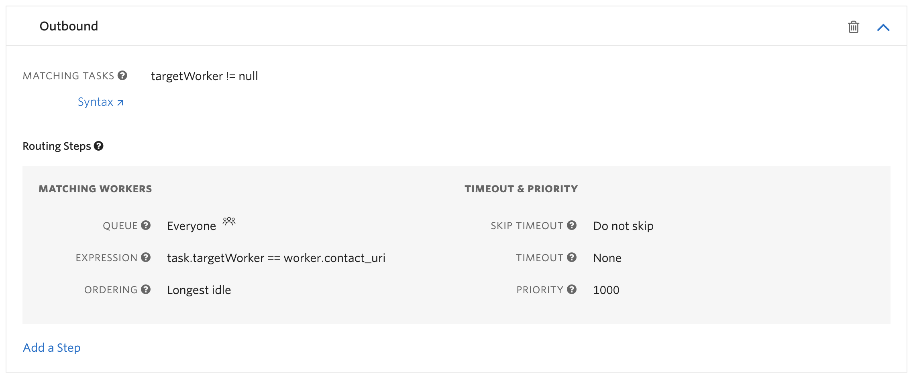

# Native Flex Dialpad Add-on

The native Flex Dialpad does not support agent-to-agent direct calls or external transfers yet. This plugin is meant to be an add-on to the native Flex Diapad, adding both agent-to-agent direct calls and external transfers. The UK version of this plugin is only build for making outbound calls within the UK. When dialing an external number do not include the country code.

## Flex plugin

A Twilio Flex Plugin allow you to customize the appearance and behavior of [Twilio Flex](https://www.twilio.com/flex). If you want to learn more about the capabilities and how to use the API, check out our [Flex documentation](https://www.twilio.com/docs/flex).

## How it works

This plugin uses Twilio Functions and WorkerClient's createTask method to create conferences and TaskRouter tasks for orchestration in both agent-to-agent calls and external transfers features.

### Agent-to-agent direct call

This part adds a call agent section to the _Outbound Dialer Panel_. In this section, there is a dropdown where you can select the agent you want to call directly. After selecting and clicking the call button, the WorkerClient's createTask method is used to create the outbound call task having the caller agent as target. When the task is sent to this agent, the AcceptTask action is overridden so we can control all the calling process. Then, we use the reservation object inside the task payload to call the caller agent. This reservation object is part of the TaskRouter Javascript SDK bundled with Flex. The URL endpoint of this call is used and pointed to a Twilio Function that retuns a TwiML which in turns create a conference and sets the statusCallbackEvent. The latter endpoint will be used to create the called agent task.

In the called side, the AcceptTask action is also overridden and a similar calling process is done. The difference is that the URL endpoint points to a different Twilio Function that returns a simple TwiML which in turns calls the conference created on the caller side.

### External transfer

When in a call, a "plus" icon is added to the Call Canvas where you can add a external number to the call. This action executes a Twilio Function that uses the Twilio API to make a call and add this call to the current conference. In the Flex UI side, the participant is added manually and both hold/unhold and hangup buttons are available.

This feature is based on the work on this [project](https://github.com/twilio-labs/plugin-flex-outbound-dialpad).

# Configuration

## Flex Plugin

This repository is a Flex plugin with some other assets. The following describes how you setup, develop and deploy your Flex plugin.

### Requirements

This plugin uses the Twilio CLI for deployment and development.

- Install or update the Twilio CLI to the latest version
  - Instructions: https://www.twilio.com/docs/twilio-cli/quickstart#install-twilio-cli
- Install or update the Flex CLI Plugin to the latest version

  - Instructions: https://www.twilio.com/docs/flex/developer/plugins/cli/install

- Install the Twilio Serverless plugin.
  - Instructions: https://www.twilio.com/docs/twilio-cli/plugins#available-plugins

### Setup

Make sure you have [Node.js](https://nodejs.org) as well as [`npm`](https://npmjs.com) installed.

Afterwards, install the dependencies by running `npm install`:

```bash
cd

# If you use npm
npm install
```

In the `/public` directory make a copy of the `appConfig.examples.js` file and rename it to `appConfig.js`, copy the contents from `appConfig.examples.js` and paste it into `appConfig.js`.

---

### Development

In order to develop locally, you can use the Twilio CLI to run the plugin locally. Using your commandline run the following from the root dirctory of the plugin.

```bash
twilio flex:plugins:start
```

This will automatically start up the Webpack Dev Server and open the browser for you. Your app will run on `http://localhost:3000`.

When you make changes to your code, the browser window will be automatically refreshed.

---

### Deploy

#### Plugin Deployment

Once you are happy with your plugin, you have to deploy then release the plugin for it to take affecte on Twilio hosted Flex.

Run the following command to start the deployment:

```bash
twilio flex:plugins:deploy --major --changelog "Notes for this version" --description "Functionality of the plugin"
```

After your deployment runs you will receive instructions for releasing your plugin from the bash prompt. You can use this or skip this step and release your plugin from the Flex plugin dashboard here https://flex.twilio.com/admin/plugins

#### Serverless Deployment

From the commandline cd into the `/serverless` directory. Run the following command to deploy the severless code.

```bash
twilio serverless:deploy
```

---

## TaskRouter

Before using this plugin you must first create a dedicated TaskRouter workflow or just add the following filter to your current workflow. Make sure it is part of your Flex Task Assignment workspace.

- ensure the following matching worker expression: _task.targetWorker==worker.contact_uri_
- ensure the priority of the filter is set to 1000 (or at least the highest in the system)
- make sure the filter matches to a queue with Everyone on it. The default Everyone queue will work but if you want to seperate real time reporting for outbound calls, you should make a dedicated queue for it with a queue expression
  _1==1_



### TaskQueue Expression

In the TaskQueues make sure the TaskQueue expression includes logic that will pull in workers with the skill that is the same name of the TaskQueue. For exameple:

A TaskQueu named `Vendor Relations` should have an expression that reads `"Vendor Relations" IN routing.skills`.

The agent should also have a skill of the same name, `Vendor Relations`. The skills can be created here: https://flex.twilio.com/admin/skills and can be assigned to an agent here: https://flex.twilio.com/teams/workers.

Setting this up allows for agents to be filtered by queue when making agent to agent calls.

# High Level - How to use

1. Setup all dependencies above: the workflow and Twilio CLI packages.

2. Clone this repository

3. Copy .env.example to .env and set the following variables:

   - REACT_APP_SERVICE_BASE_URL: your Twilio Functions base url (this will be available after you deploy your functions). In local development environment, it could be your localhost base url.
   - REACT_APP_TASK_CHANNEL_SID: the TaskRouter voice channel SID

   **Note**: Remember that the .env is for front-end use so do not add any type of key/secret variable to them. Also, just variables starting with the name _REACT*APP*_ will work.

4. run `npm install`

5. copy ./serverless/.env.sample to ./serverless/.env and populate the appropriate environment variables.

6. cd into ./serverless/ then run `npm install` and then `twilio serverless:deploy` (optionally you can run locally with `twilio serverless:start --ngrok=""`

7. cd back to the root folder and run `twilio flex:plugins:start` to run locally or `twilio flex:plugins:deploy --minor --changelog "Replace with notes for this version" --description "Replace with description"`.

# Known issues

1. When in an agent-to-agent call, the transfer button is disabled.
2. When in an agent-to-agent call, an external transfer is done correctly but the UI does not reflect what is going on.

# Old issues

**Note**: If you are suffering from any of the following issues, please update your plugin with the last version of this repository.

1. In the first versions, the environment variables were set by the UI Configuration (please refer to this [documentation](https://www.twilio.com/docs/flex/ui/configuration)) but it was overriding some other variables with no relation to this plugin. Because of that, some features inside Flex were breaking. Now, there are two files (.env.development and .env.production) that gather all the environment variables.
2. Before, the worker's contact_uri was extracted from `manager.user.identity` which has its problems depending on its format. It is now being extract from `manager.workerClient.attributes.contact_url` directly. (Thanks to [@hgs-berlee](https://github.com/hgs-berlee) who pointed that out and suggested this solution)
3. Before, when in an external transfer, the hold/unhold button was executing these actions on the first participant and not on the correct one. Now, this is fixed.

## Disclaimer

This software is to be considered "sample code", a Type B Deliverable, and is delivered "as-is" to the user. Twilio bears no responsibility to support the use or implementation of this software.
